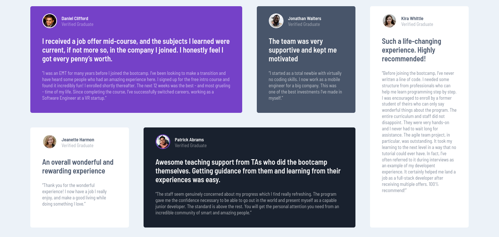

# Frontend Mentor - Testimonials grid section solution

This is a solution to the [Testimonials grid section challenge on Frontend Mentor](https://www.frontendmentor.io/challenges/testimonials-grid-section-Nnw6J7Un7). Frontend Mentor challenges help you improve your coding skills by building realistic projects. 

## Table of contents

- [Overview](#overview)
  - [The challenge](#the-challenge)
  - [Screenshot](#screenshot)
  - [Links](#links)
- [My process](#my-process)
  - [Built with](#built-with)
  - [What I learned](#what-i-learned)
  - [Continued development](#continued-development)

## Overview

### The challenge

I did this challenge in three three days. I used the BEM method or I tried to use the BEM method for my css name classes, I make this challenge 99% grid and just 1% flexbox, I only used flexbox in the title__name and title__secondary. I used the properties of grid called grid-template-areas and grid-areas for their child. I have not to say, I did my best and I'm satisfied with the result.

### Screenshot

### Links

- Solution URL: [I am watching the grid course of wesbos, it is really good and I recommend you if you have knowledge about grid.](https://courses.wesbos.com/)

## My process

### Built with

- Semantic HTML5 markup
- CSS custom properties
- Flexbox
- CSS Grid
- Git

### What I learned

This is my first project where I am using grid and git so you can download different version about this challenge, I am beginner so if you see an error in my git I appreciate your feedback.

### Continued development

I will continue development my skills in a lot of topics like Grid, flexbox, responsive design and now Git.

